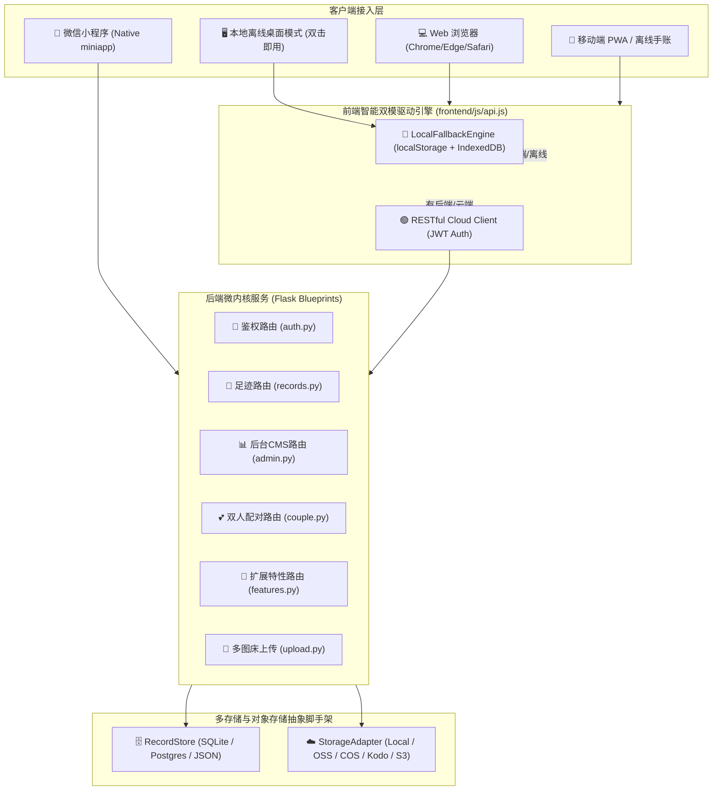

# 足迹 (Footprint) 全栈架构设计与二次开发底座指南

> **版本**：v1.0.0 (Official Release)  
> **定位**：聚焦“旅行探索 + 美食寻味”的生活方式足迹记录平台，内置情侣双人协同空间，支持纯本地免装离线桌面伪应用与云端生产级全栈部署。

---

## 1. 架构总览与核心设计哲学



### 核心设计原则
1. **主页永远聚焦“旅行 + 美食”**：
   - 旅行与美食是天然共存的生活方式主题，构成了平台最核心的第一视觉与打卡主线；
   - **情侣模式收敛于后台管理**：作为高阶增值层，默认不喧宾夺主，在后台开启并配对后，前台才动态激活情侣专属工具组与双人甜蜜元素。
2. **极简零依赖与双模自适应**：
   - **免安装纯本地伪应用**：双击 `启动足迹-本地模式.bat` 或在没有 Python/服务端的环境下直接打开 `index.html`，底层自动切换至 `LocalFallbackEngine`，照片自动转为 Base64 本地安全存储，开箱即用；
   - **全栈生产模式**：启动后端时自动开启多用户物理隔离、双人浪漫配对、对象存储直传与 PostgreSQL 高可用持久化。
3. **彻底根除 AI 模板塑料感**：
   - 摒弃蓝紫荧光色，确立黑曜石（`#0B0E14`）、冷杉青（`#0D9488`）、暖金琥珀（`#D97706`）及羊皮纸米白（`#F8F6F0`）的大地自然质感；
   - 引入 Lucide 风格的纯矢量 24x24 黄金网格 SVG 图标库（`frontend/js/icons.js`），彻底淘汰各平台参差不齐的彩色 Emoji。

---

## 2. 前端模块解耦与目录结构

```
frontend/
├── index.html               # 前台单页宿主应用 (SPA)
├── admin.html               # 网页管理后台 (排版定制、足迹CMS、情侣配置、数据库/图床监控)
├── settings.html            # 个人偏好设置与系统配置
├── css/
│   ├── base.css             # 现代化 Design Tokens、色彩系统与 Lucide SVG 图标样式
│   ├── layout.css           # 栅格响应式布局与杂志级卡片系统
│   └── components.css       # 模态框、按钮组与瑞士排版数据看板
└── js/
    ├── state.js             # 全局响应式状态机与本地缓存驱动
    ├── api.js               # 智能双模引擎：优先云端，离线时无缝降级为纯本地持久化
    ├── icons.js             # 100% 纯本地高级矢量 SVG 图标引擎 (AppIcons)
    ├── quick-catch.js       # 3秒极速闪录：EXIF GPS 解析与逆地理智能地名推断
    ├── food-wheel.js        # “今天吃什么”美食决策轮盘
    ├── globe-conquest.js    # 3D WebGL 点亮地球：中国地级市细密浮雕 + 全球太空视角
    ├── passport.js          # 虚拟通关护照本与城市三字码复古海关入境印章墙
    ├── badges.js            # 旅行家 8 阶成就勋章体系与成长进度
    ├── packing-list.js      # 出游行李准备清单 (证件/数码/洗护/常备药)
    ├── love-capsule.js      # 情侣大日子里程碑倒数日与未来时光胶囊
    └── couple-pair.js       # 双人空间 6 位邀请码生成与配对管理组件
```

---

## 3. 后端服务分层与数据隔离

后端采用模块化蓝图设计，位于 `backend/` 目录下：

```
backend/
├── app.py                  # 应用初始化、跨域、安全响应头与路由装配
├── auth.py                 # JWT 令牌签发、验证、上下文用户注入 (@login_required)
├── database.py             # 数据持久层抽象基类 (RecordStore)
│                           # ├─ SQLiteRecordStore (单文件开箱即用)
│                           # ├─ PostgresRecordStore (生产高并发)
│                           # └─ JsonRecordStore (文件向后兼容)
├── storage.py              # 对象存储服务适配器 (Local, OSS, COS, Kodo, S3)
├── helpers.py              # EXIF 提取、安全过滤、分页与数据规约
└── routes/
    ├── records.py          # 足迹的核心增删改查、批量导入与导出
    ├── couple.py           # 双人空间邀请码生成、绑定配对、解绑与状态查询
    ├── admin.py            # 管理后台概览、前台排版配置、数据库/存储健康探针
    ├── features.py         # 扩展业务特性 (动态支持 couple_space_id 空间共享)
    ├── upload.py           # 图片多图床上传与反向代理
    └── wechat.py           # 微信小程序专属静默登录与配置接口
```

### 双人情侣空间数据协同协议
- **用户表扩展**：用户具备 `partner_id`（绑定的伴侣 ID）与 `couple_space_id`（浪漫空间命名空间）；
- **动态特性隔离**：
  - 常规旅行与个人足迹以 `user_id` 为边界隔离；
  - 当访问情侣专属特性（`anniversaries`, `love_notes`, `date_plans`, `couple_tasks`, `wishes`, `love_capsules`）且处于配对状态时，自动以 `couple_space_id` 作为存储主体，**实现双人任何一方记录，对方实时自动同步**。

---

## 4. 二次开发与底座扩展手册

如果你希望将本项目作为二次开发底座（例如：新增“🐾 宠物足迹”、“⛺ 露营装备路线”、“🚲 骑行轨迹”），遵循以下标准化步骤即可快速扩展：

### 步骤 1：前端新增业务模式或功能模块
在 `frontend/js/` 目录下新建模块文件（如 `frontend/js/pet-module.js`）：
```javascript
const PetModule = {
    open() {
        // 创建或拉起弹窗/业务面板
        toast('🐾 宠物相伴足迹就绪');
    }
};
window.PetModule = PetModule;
```
在 `frontend/index.html` 引入并注册胶囊按钮：
```html
<script src="js/pet-module.js"></script>
...
<button class="feature-pill-btn" onclick="PetModule.open()">
    <span data-icon="compass"></span><span>宠物足迹</span>
</button>
```

### 步骤 2：在矢量图标库中扩充新图标
若需新图标，打开 `frontend/js/icons.js`，在 `definitions` 字典中添加对应的 24x24 SVG 路径即可全站通用：
```javascript
'paw': '<circle cx="12" cy="14" r="4"/><circle cx="6" cy="9" r="2.5"/><circle cx="18" cy="9" r="2.5"/>'
```

### 步骤 3：后端扩展新特性命名空间
若该业务模块需要云端多端同步，打开 `backend/routes/features.py`，将特性名称加入白名单：
```python
ALLOWED_FEATURES = {
    ...
    'pet_logs',   # 新增的宠物记录特性
}
```
此时无需修改任何数据库 DDL，系统自动完成多用户隔离存储或情侣双向同步！

---

## 5. 开箱即用与生产部署

### 方案 A：Windows 免安装离线桌面模式（新手首选）
1. 解压项目压缩包；
2. 双击运行根目录的 **`启动足迹-本地模式.bat`**；
3. 浏览器自动唤醒进入系统，数据安全保存在本机浏览器中。

### 方案 B：本地 Python 全栈运行
```bash
# 1. 创建并激活虚拟环境
python -m venv venv
venv\Scripts\activate  # Windows
source venv/bin/activate  # macOS/Linux

# 2. 安装依赖
pip install -r requirements.txt

# 3. 运行主服务
python app.py
```
浏览器访问：`http://localhost:5000`。

### 方案 C：Docker 生产容器化编排
```bash
docker-compose up -d --build
```
内置 Nginx 反向代理、Gunicorn 生产 WSGI 容器与持久化数据卷。
